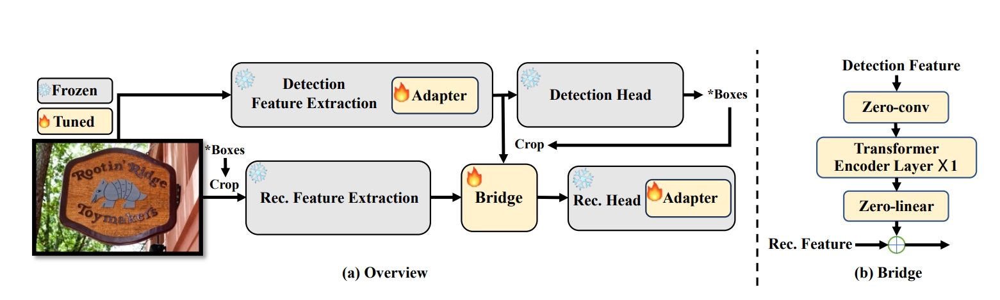

<h1 align="center"> Bridging the Gap Between End-to-End and Two-Step Text Spotting </h1> 

<p align="center">
<a href="https://arxiv.org/pdf/2404.04624.pdf">"></a>
</p>

<p align="center">
  <a href="#Updates">Updates</a> |
  <a href="#Main Results">Main Results</a> |
  <a href="#Usage">Usage</a> |
  <a href="#Citation">Citation</a> |
  <a href="#Acknowledgment">Acknowledgement</a>
</p >
This is the official repo for the paper "Bridging the Gap Between End-to-End and Two-Step Text Spotting", which is accepted to CVPR 2024.



## Updates
`[Apr.08, 2024]`The paper is submitted to ArXiv. 🔥🔥🔥 You can use only a single 3090 to train the model.

## Main Results

**Total-Text**
|Method|Det-P|Det-R|Det-F1|E2E-None|E2E-Full|Weights|
|:------:|:------:|:------:|:------:|:------:|:------:|:------:|
|DG-Bridge Spotter|92.0|86.5|89.2|83.3|88.3|[Google Drive](https://drive.google.com/file/d/15GnzJx_Cd0gKHGUzam5zcEFiPwbBOT-D/view?usp=sharing)|

**CTW1500**
|Method|Det-P|Det-R|Det-F1|E2E-None|E2E-Full|Weights|
|:------:|:------:|:------:|:------:|:------:|:------:|:------:|
|DG-Bridge Spotter|92.1|86.2|89.0|69.8|83.9|[Google Drive](https://drive.google.com/file/d/1_7WuMHH2x14ScHHEHWCymdUoxhQSjR84/view?usp=sharing)|

**ICDAR 2015 (IC15)**
|Backbone|Det-P|Det-R|Det-F1|E2E-S|E2E-W|E2E-G|Weights|
|:------:|:------:|:------:|:------:|:------:|:------:|:------:|:------:|
|TG-Bridge Spotter|93.8|87.5|90.5|89.1|84.2|80.4|[Google Drive](https://drive.google.com/file/d/1w49lAUGIBRF9EtXQEhh_Tl02k-7pRkp_/view?usp=sharing)|


## Usage

It's recommended to configure the environment using Anaconda. Python 3.8 + PyTorch 1.9.1 (or 1.9.0) + CUDA 11.1 + Detectron2 (v0.6) are suggested.

- ### Installation
```
conda create -n Bridge python=3.8 -y
conda activate Bridge
pip install torch==1.9.1+cu111 torchvision==0.10.1+cu111 -f https://download.pytorch.org/whl/torch_stable.html
pip install opencv-python scipy timm shapely albumentations Polygon3
pip install setuptools==59.5.0
git clone https://github.com/mxin262/Bridging-Text-Spotting.git
cd Bridging-Text-Spotting
cd detectron2
python setup.py build develop
cd ..
python setup.py build develop
```

- ### Data Preparation

>**Total-Text (including rotated images)**: [link](https://1drv.ms/u/s!AimBgYV7JjTlgccOW1TUlgm64M0yRA?e=jwY6b1)
>
>**CTW1500 (including rotated images)**: [link](https://1drv.ms/u/s!AimBgYV7JjTlgccPGEv4DkiUl23MEg?e=44CtL6)
>
>**ICDAR2015 (images)**: [link](https://ucsdcloud-my.sharepoint.com/:u:/g/personal/xiz102_ucsd_edu/EWgEM5BSRjBEua4B_qLrGR0BaombUL8K3d23ldXOb7wUNA?e=7VzH34).
>
>**Json files for Total-Text and CTW1500:** [OneDrive](https://1drv.ms/u/s!AimBgYV7JjTlgccNWKEMwwbJO4TYQw?e=ridXPV) | [BaiduNetdisk](https://pan.baidu.com/s/1bDE1z6c7z6wCTY5W-jJ3Qw)(44yt)
>
>**Json files for ICDAR2015:** [link](https://ucsdcloud-my.sharepoint.com/:u:/g/personal/xiz102_ucsd_edu/ES4aqkvamlJAgiPNFJuYkX4BLo-5cDx9TD_6pnMJnVhXpw?e=tu9D8t),
> 
>**Evaluation files:** [link](https://ucsdcloud-my.sharepoint.com/:u:/g/personal/xiz102_ucsd_edu/Ea5oF7VFoe5NngUoPmLTerQBMdiVUhHcx2pPu3Q5p3hZvg?e=2NJNWh). Extract them under `datasets` folder.

Organize them as follows:
```
|- datasets
   |- totaltext
   |  |- test_images_rotate
   |  |- train_images_rotate
   |  |- test_poly.json
   |  |- test_poly_rotate.json
   |  |─ train_poly_ori.json
   |  |─ train_poly_pos.json
   |  |─ train_poly_rotate_ori.json
   |  └─ train_poly_rotate_pos.json
   |- ctw1500
   |  |- test_images
   |  |- train_images_rotate
   |  |- test_poly.json
   |  └─ train_poly_rotate_pos.json
   |- icdar2015
   |   | - test_images
   |   | - train_images
   |   | - test.json
   |   | - train.json
   |- evaluation
   |  |- lexicons
   |  |- gt_totaltext.zip
   |  |- gt_ctw1500.zip
   |  |- gt_inversetext.zip
   |  └─ gt_totaltext_rotate.zip
```

The generation of positional label form for DPText-DETR is provided in `process_positional_label.py`

- ### Training
Download the pre-trained model from [DPText-DETR](https://github.com/ymy-k/DPText-DETR/tree/main), [DiG](https://github.com/ayumiymk/DiG), [TESTR](https://github.com/mlpc-ucsd/TESTR/tree/main).

With the pre-trained model, use the following command to fine-tune it on the target benchmark. For example:

```
python tools/train_net.py --config-file configs/Bridge/TotalText/R_50_poly.yaml --num-gpus 4  MODEL.WEIGHTS totaltext_final.pth
```

- ### Evaluation
```
python tools/train_net.py --config-file ${CONFIG_FILE} --eval-only MODEL.WEIGHTS ${MODEL_PATH}
```

- ### Inference & Visualization
```
python demo/demo.py --config-file ${CONFIG_FILE} --input ${IMAGES_FOLDER_OR_ONE_IMAGE_PATH} --output ${OUTPUT_PATH} --opts MODEL.WEIGHTS <MODEL_PATH>
```

## Citation

If you find Bridge Text Spotting useful in your research, please consider citing:
```bibtex
@inproceedings{huang2024bridge,
  title={Bridging the Gap Between End-to-End and Two-Step Text Spotting},
  author={Huang, Mingxin and Li, Hongliang and Liu, Yuliang and Bai, Xiang and Jin, Lianwen},
  booktitle={Proceedings of the IEEE/CVF Conference on Computer Vision and Pattern Recognition},
  year={2024}
}
```

## Acknowlegement
[AdelaiDet](https://github.com/aim-uofa/AdelaiDet), [DPText-DETR](https://github.com/ymy-k/DPText-DETR/tree/main), [DiG](https://github.com/ayumiymk/DiG), [TESTR](https://github.com/mlpc-ucsd/TESTR/tree/main). Thanks for their great work!
